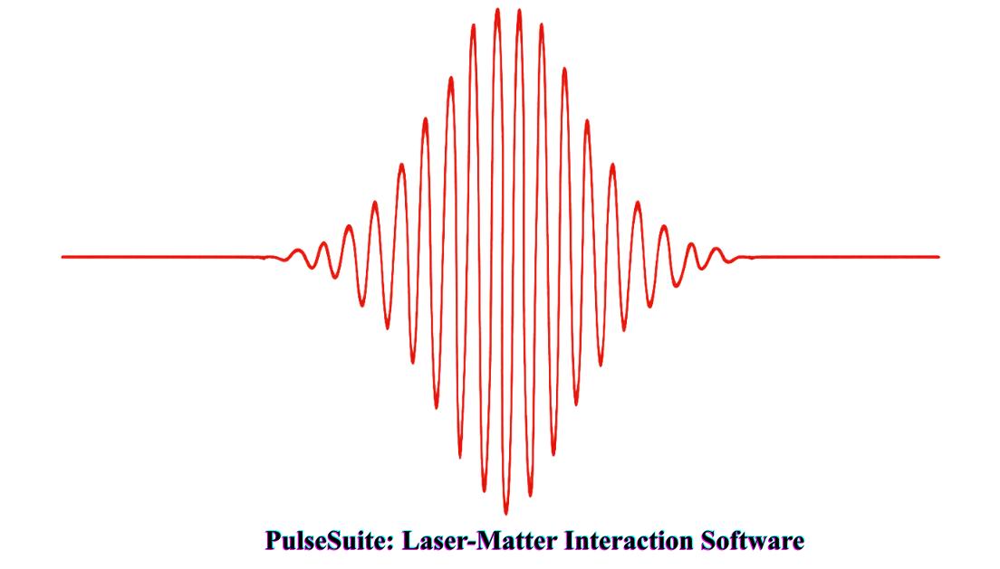

<p align="center">
  <a href="https://pulsesuite0.readthedocs.io">
    
  </a>
</p>

[](https://pulsesuite0.readthedocs.io)
[](COPYING)
[](https://www.python.org/)

PulseSuite is a high-performance computational physics toolkit for simulating ultrafast laser-matter interactions in semiconductor quantum structures. It implements the **Semiconductor Bloch Equations (SBEs)** coupled with **Pseudo-Spectral Time Domain (PSTD)** electromagnetic field propagation methods to model quantum wire and quantum well systems under intense optical excitation.

This codebase is a Python port of production Fortran simulation tools using NumPy, accelerated FFTs (pyFFTW), Numba JIT and CUDA compilation.

## Features

- **Quantum Well/Wire Optics**: Bloch Equations, Field transformations, polarization calculations, density matrix evolution
- **Many-Body Physics**: Coulomb interactions with screening, phonon scattering, carrier dynamics
- **Electromagnetic Field Propagation**: Pseudo-Spectral Time Domain (PSTD)
- **High Performance**: JIT compilation, CUDA, Vectorization, Parallelization

## Installation

PulseSuite uses [uv](https://docs.astral.sh/uv/) for dependency management and [just](https://github.com/casey/just) as a command runner.

```bash
# Clone the repository
git clone https://github.com/pulsesuite0/pulsesuite.git
cd pulsesuite

# Install uv (if not already installed)
curl -LsSf https://astral.sh/uv/install.sh | sh

# Sync all dependencies (core + test + doc) in one step
uv sync --all-extras

# Or install with pip (still works)
pip install -e .
```

### GPU Acceleration (optional)

If you have an NVIDIA GPU, install the GPU extra to enable CUDA acceleration.
This installs `cupy-cuda12x` (GPU array ops) and `numba-cuda` (Numba `@cuda.jit`
kernels). No separate CUDA toolkit download needed — only an NVIDIA driver
(version 450+). The code automatically detects GPU availability and falls back
to CPU if CUDA is not present.

```bash
uv pip install -e ".[gpu]"
```

### Development

```bash
just              # run tests + lint + format check
just test         # run test suite (just test -k coulomb to filter)
just lint         # ruff lint check
just fmt          # auto-format code
just --list       # see all available commands
```

## Documentation

Full documentation: [pulsesuite0.readthedocs.io](https://pulsesuite0.readthedocs.io)

- **Examples Gallery**: End-to-end simulation walkthroughs
- **API Reference**: Complete function and class documentation
- **Simulation Guide**: Parameter reference and build instructions

## Running a simulation

```bash
# 1D quantum wire SBE example
python docs/source/examples/sbe_wire_1d.py

# 3D with longitudinal field decomposition (requires params files)
python docs/source/examples/sbe_wire_3d_longitudinal.py
```

Output is written to `fields/`.

## Package Structure

```
src/pulsesuite/
    core/           # Core utilities (FFT, constants, integrators)
    PSTD3D/         # Quantum wire/well physics modules
        SBEs.py     # Semiconductor Bloch Equations
        coulomb.py  # Coulomb interactions
        dcfield.py  # DC field transport
        emission.py # Spontaneous emission
        phonons.py  # Phonon scattering
        qwoptics.py # Quantum well optics
        PSTD3D.py   # 3D Maxwell propagator
    libpulsesuite/  # Low-level utilities and integrators
```

## Requirements

- Python >= 3.10
- NumPy >= 1.26.4
- SciPy >= 1.15.2
- Matplotlib >= 3.10.0
- pyFFTW >= 0.15.0
- Numba >= 0.61.2
- CuPy + numba-cuda (optional, `pip install -e ".[gpu]"`)

## Contributing

We welcome contributions! Please see [CONTRIBUTING.md](CONTRIBUTING.md) for guidelines.

## Citation

If you use PulseSuite in your research, please cite:

```bibtex
@software{pulsesuite2025,
  title  = {PulseSuite: Simulation suite for ultrafast laser-matter interactions},
  author = {Sah, Rahul R. and Hatten, Emily S. and Gulley, Jeremy R.},
  year   = {2025},
  url    = {https://github.com/pulsesuite0/pulsesuite}
}
```

See [CITATION.cff](CITATION.cff) for machine-readable citation metadata.

## Authors

See [AUTHORS.md](AUTHORS.md) for the complete list of contributors.

## License

This project is licensed under the LGPL-3.0-or-later — see [COPYING](COPYING) for details.

## Acknowledgments

This codebase inherits from the Fortran simulation tools developed by [Jeremy R. Gulley](https://www.furman.edu/people/jeremy-r-gulley/) and collaborators at Furman University.